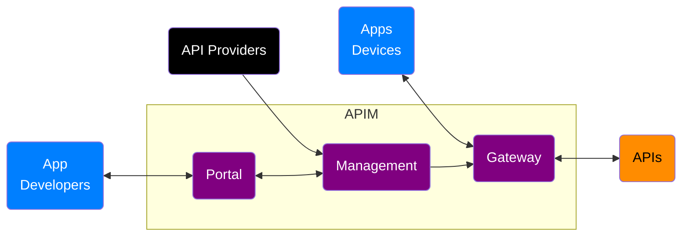
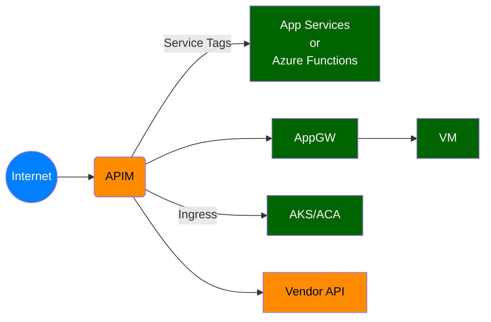
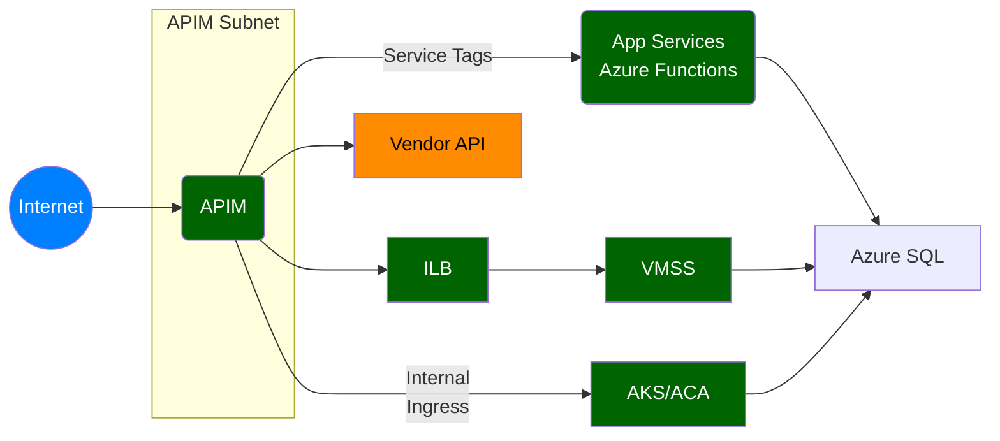
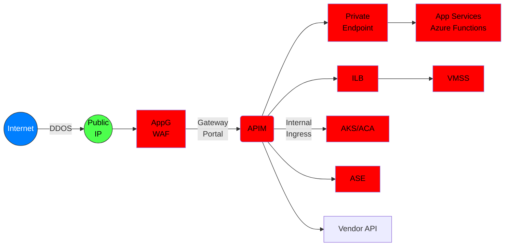

# Azure API Management Networking and Security

## Overview

## API Management Networking Modes

- Default: Not deployed to VNET, exposes public gateway and portal, and can acccess external APIs only
- External: Deployed to VNET, exposes public gateway and portal, and can access internal and external APIs
- Internal: Deployed to VNET, expoese private gateway and portal, and can access internal and external APIs

## API Management configuration in order of improved security

### API Management Components

### Default API Management Deployment and External APIs

Azure Services:
- API Management in External Mode
- Depending on how API are exposed:
  - Azure App Services
  - Azure VMs
  - Etc.

Security:
- No WAF (Recommended)
- No DDOS (Recommended)
- Communication from APIM to App Services and Functions could leverage Service Tags
- Traffic from API to APIs flows over the Internet

### External API Management Deployment and External and Internal APIs

Azure Services:
- VNET
- AppGW
- API Management in External Mode
- Depending on how API are exposed:
  - Azure App Services
  - Azure VMs  
  - Private Endpoints
  - Etc.

Security:
- No WAF
- No DDOS
- APIM deployed to VNET subnet obtains private IP
- Communication to APIs can be over private IPs to internal services or public endpoints
- Traffic from internet to Azure backed APIs flows all internally over the Azure backbone

### Application Gateway, Internal API Management, Internal and External APIs

Azure Services:
- Public IP
- VNET
- AppGW
- API Management in External Mode
- Depending on how API are exposed:
  - Azure App Services
  - Azure VMs  
  - Private Endpoints
  - Etc.

Security:
- DDOS on Public IP
- WAF on AppGW and can do SSL offloading or end-to-end encryption
- APIM deployed to VNET subnet obtains private IP
- Internal or external access to the APIs over the AppGw
- Communication to APIs can be over private IPs to internal services or public endpoints
- Traffic from internet to Azure backed APIs flows all internally over the Azure backbone

### Reference

- [API Management Networking](https://learn.microsoft.com/en-us/azure/api-management/virtual-network-concepts?tabs=stv2)
