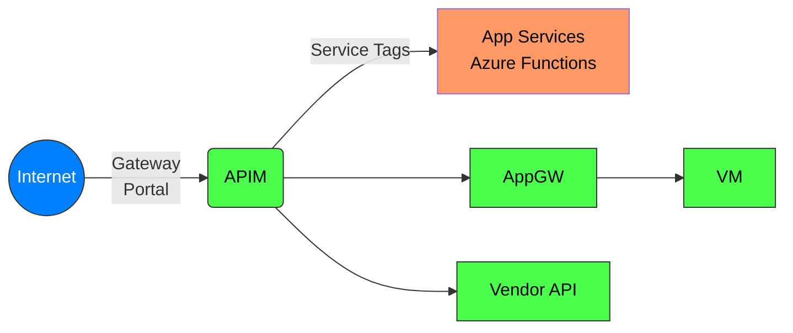
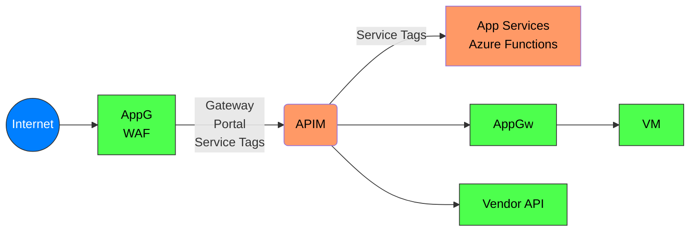

# Azure API Management Networking

### External API Management and External APIs

Azure Services:
- API Management in External Mode
- Depending on how API are exposed:
  - Azure App Services
  - Azure VMs
  - Etc.

Security:
- No WAF (Recommended)
- No DDOS (Recommended)
- Communication from APIM to App Services and Functions could leverage Service Tags

### Application Gateway, External API Management and External APIs

### Internal with internal and external services

### Internal with AKS internal
