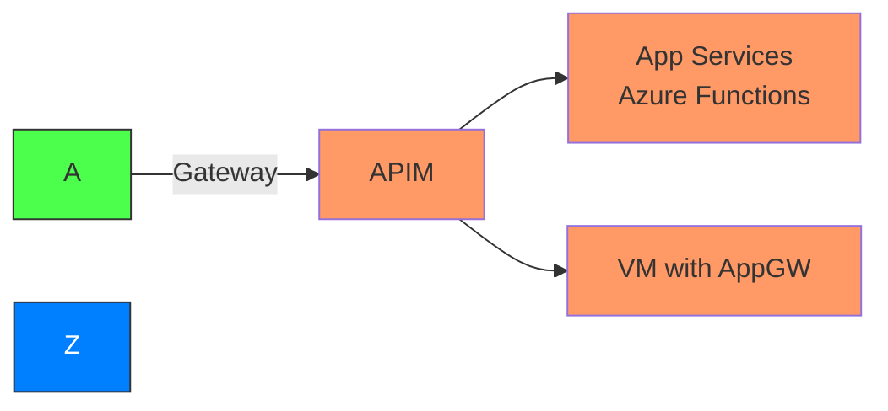

# Azure API Management Security Models

### APIM Fully External

```mermaid
graph LR;
    A--Gateway-->B[APIM]
    B-->C[App Services<br/>Azure Functions]
    B-->D[VM with AppGW]
    style Z fill:#007FFF,stroke:#333,stroke-width:1px,color:#fff;
    style A fill:#4DFF4D,stroke:#333,stroke-width:1px;
    classDef someclass fill:#f96;
    class B,C,D someclass;
```

### ApppGw/WAF and Fully External

### Internal with internal and external services

### Internal with AKS internal
