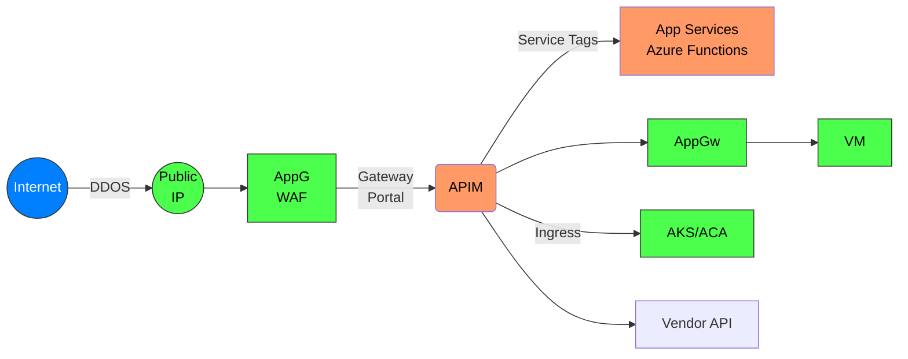
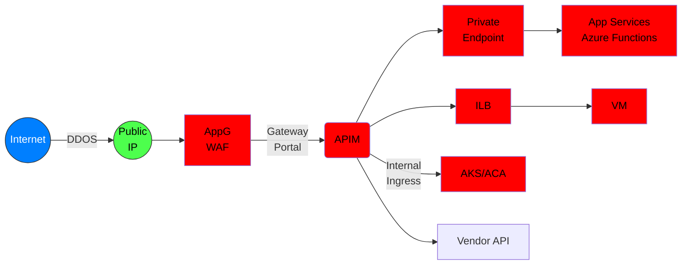

# Azure API Management Networking

## API Management configuration in order of improved security

### External API Management and External APIs

Azure Services:
- API Management in External Mode
- Depending on how API are exposed:
  - Azure App Services
  - Azure VMs
  - Etc.

Security:
- No WAF (Recommended)
- No DDOS (Recommended)
- Communication from APIM to App Services and Functions could leverage Service Tags

### Application Gateway, External API Management and External APIs

Azure Services:
- API Management in External Mode
- Depending on how API are exposed:
  - Azure App Services
  - Azure VMs
  - Etc.

Security:
- No WAF (Recommended)
- No DDOS (Recommended)
- Communication from APIM to App Services and Functions could leverage Service Tags

### Internal with internal and external services

Azure Services:
- Public IP
- VNET
- AppGW
- API Management in External Mode
- Depending on how API are exposed:
  - Azure App Services
  - Azure VMs
  - Etc.
  - Private Endpoint

Security:
- DDOS on Public IP
- WAF on AppGW and can do SSL offloading or end-to-end encryption
- APIM deployed to VNET subnet obtains private IP
- Communication to APIs can be over private IPs to internal services or public endpoints
